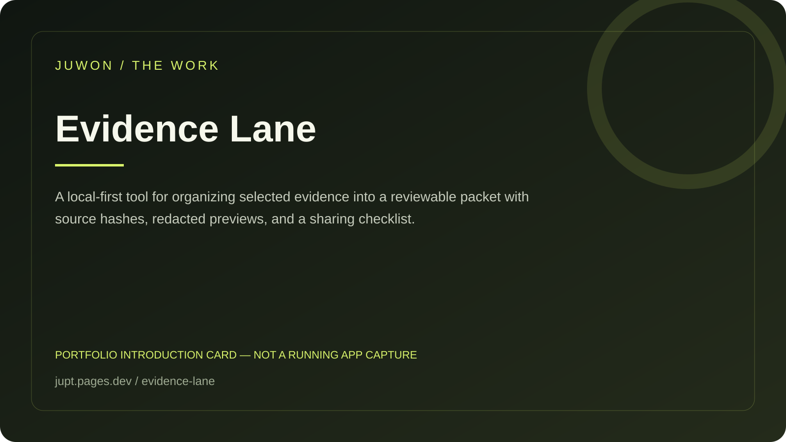

<!-- JUWON-PORTFOLIO-INTRO:START -->
# Evidence Lane



*Portfolio introduction card, not a screenshot of a running application.*

*포트폴리오 소개 카드입니다. 실행 화면 캡처가 아닙니다.*

## English

A local-first tool for organizing selected evidence into a reviewable packet with source hashes, redacted previews, and a sharing checklist.

[View JUWON's portfolio](https://jupt.pages.dev/) · [Browse the project collection](https://jupt.pages.dev/projects)

**Scope:** This README presents the repository's documented intent and recorded visual evidence. It does not certify that every feature is complete, deployed, or currently working. Follow the original setup, safety, and license documentation below.

## 한국어

흩어진 자료를 출처와 개인정보 검토가 있는 증거 패키지로 정리하는 도구.

[JUWON 포트폴리오 보기](https://jupt.pages.dev/) · [전체 프로젝트 보기](https://jupt.pages.dev/projects)

**확인 범위:** 저장소의 문서상 목적과 기록된 화면 근거를 소개합니다. 모든 기능의 완성·배포·현재 정상 작동을 보증하지 않습니다. 설치법·안전 주의사항·라이선스는 아래 기존 문서를 확인하세요.
<!-- JUWON-PORTFOLIO-INTRO:END -->

---

## Original documentation / 기존 문서

# Evidence Lane 🛡️

### Your screenshots are evidence. Your inbox is evidence. Don’t send your whole life to explain one problem.

Evidence Lane turns a messy local folder—receipts, screenshots, emails, and notes—into one honest, reviewable case packet.

```text
14 tabs + 8 screenshots + “what happened again?”
                         ↓
                 evidence-lane pack
                         ↓
One timeline · redacted previews · source hashes · sharing checklist
```

It is local-first, dependency-light, and deliberately not an AI storyteller. It never uploads your files, edits your originals, silently installs anything, or invents a claim.

## Why it exists

Everyday problems often require proof, not another task list:

- a damaged order and a return request;
- a reimbursement with receipts and a timeline;
- a support ticket with screenshots and attempted fixes;
- a landlord, school, insurer, or service provider who needs the whole story once.

The pain is the handoff. Evidence Lane makes the handoff inspectable before you send it.

## Quick start ⚡

```bash
npm install
npm test
npm run build

node dist/src/cli.js pack examples/return-case \
  --output examples/return-case/return-packet.html
```

Open `examples/return-case/return-packet.html` in any browser. It is a standalone HTML file with no network dependency.

Other formats:

```bash
node dist/src/cli.js pack ./my-case --format markdown --output ./my-case.md
node dist/src/cli.js pack ./my-case --format json --output ./my-case.json
```

## What you get

- 🧾 A case brief from optional `case.json` metadata.
- 🔗 Stable evidence IDs (`E1`, `E2`, …) and relative source paths.
- 🔐 SHA-256 for every file, including binary attachments.
- 👀 Redacted text previews for obvious emails, phone numbers, payment cards, secrets, and labeled addresses.
- 🚦 `CLEAR`, `REVIEW`, or `HIGH` risk on every item.
- ✅ A checklist that keeps the human in the sharing decision.
- 🌐 A polished HTML packet with local search and expandable previews.

## Case metadata

Put an optional `case.json` at the root of your folder:

```json
{
  "title": "Return a damaged order",
  "recipient": "Acme Support",
  "goal": "Request a return label",
  "deadline": "2026-08-30",
  "tags": ["return", "support"]
}
```

Text-like files are previewed. Images, PDFs, office files, and other binary files are inventoried with size and hash so the packet does not pretend it can read what it did not parse.

## Safety boundary 🔒

Evidence Lane is a deterministic privacy aid, not a guarantee. Pattern detection can miss names, faces, addresses without labels, OCR text inside images, or new secret formats. Always inspect the packet and the original attachments before sharing.

The v0.1 command:

- reads the input directory;
- skips only `.git`, `node_modules`, and Python virtual-environment directories;
- never sends a network request;
- never changes source files;
- writes only the output path you choose.

## Development

```bash
npm test          # build + Node test runner
npm run lint      # strict TypeScript check without emit
npm run build     # compile CLI and declarations
```

The implementation is split into four small layers:

1. `src/detect.ts` — risk patterns and safe previews.
2. `src/scan.ts` — read-only traversal, hashing, metadata, packet assembly.
3. `src/render.ts` — escaped JSON, Markdown, and self-contained HTML.
4. `src/cli.ts` — the `pack` command and output writer.

## Roadmap 🗺️

- [ ] User-approved custom redaction rules.
- [ ] Optional OCR with an explicit local provider.
- [ ] Timeline extraction that preserves source links and uncertainty.
- [ ] Attachment copy mode with a second confirmation step.
- [ ] Schema adapters for reimbursement, returns, support, and insurance.

## Contributing

Small, test-backed improvements are welcome. Read [CONTRIBUTING.md](CONTRIBUTING.md), run the full test suite, and keep the no-upload/read-only boundary intact.

## License

MIT. See [LICENSE](LICENSE).
